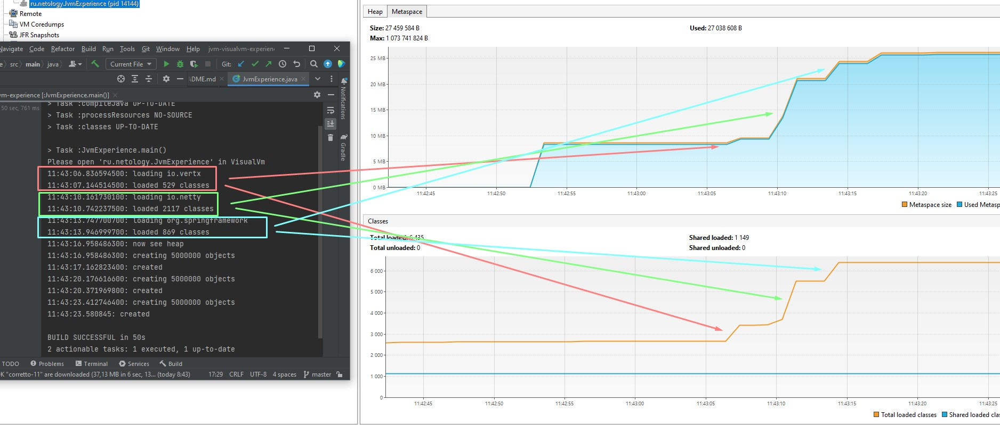
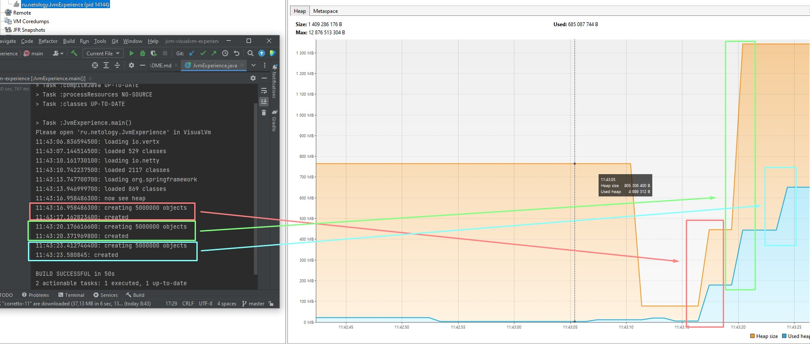

Домашнее задание для Netology.ru для курса Java Developer   

Описание и инструкция к выполнению [здесь](https://github.com/netology-code/jd-homeworks/tree/master/jvm/README.md)

**Решение:**  
На скрине видно, что в процессе загрузки данных о наборах классов растёт память, выделяемая под метаданные.  
Выделение и потребление памяти увеличивается не равными объёмами по причине того, что наборы содержат различные классы, и количество их в наборах тоже отличается. 

Далее смотрим кучу.

Видно, что при старте работы программы какое-то время под кучу выделяется около 800МБ памяти.  
В какой-то момент происходит резкий сброс выделенной под кучу памяти. Причины сброса мне не совсем понятны, но могу предположить, что реализация JVM в IIdea
"сообразила" наконец, что столько не надо выделять ввиду совсем малого процента использования и "порезала" объёмы.

Далее в три этапа равными частями создаётся 15М объектов.  
Все три этапа отчётливо видны на графике используемой памяти, в то время как на графике выделенной памяти видно лишь два увеличения объёма.  
Полагаю, что связано это с тем, что JVM предположила (и верно предположила), что ожидается последовательный рост числа объектов (раз уже второй раз идёт увеличение) и лучше уж сразу выделить памяти с запасом, а потом разберёмся. 